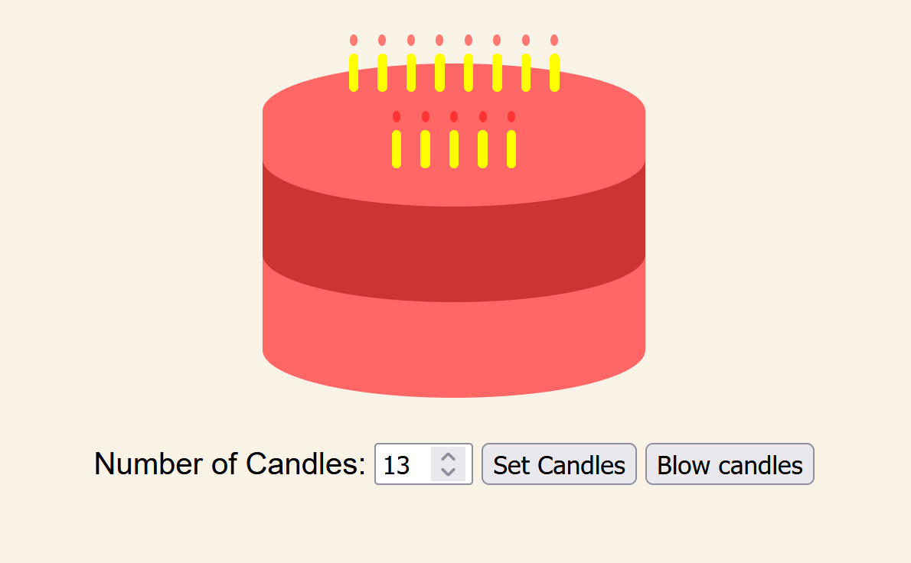
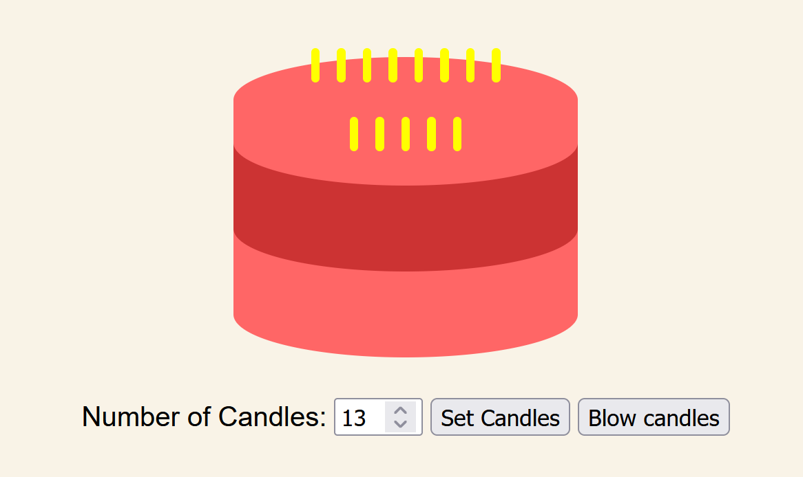

# 🎂 HTML CSS Cake

A fun, interactive project where you can create a customizable cake with candles using **HTML**, **CSS**, and **JavaScript**. This project serves as a prototype for a larger project involving cakes. 

---

## 🌟 Features

- **Dynamic Candle Generation**: Add up to 20 candles to the cake.
- **Interactive Controls**: Adjust the number of candles and blow them out with a click of a button.
- **Stylish Design**: A colorful, layered cake designed with CSS.

---

## 📂 Project Structure

├── index.html // Main HTML file 
├── styles.css // Styling for the cake and candles 
└── script.js // Functions to control candle generation and blowing out

---

## 🛠️ How to Use

1. Clone or download this repository.
2. Open the `index.html` file in any modern web browser.
3. Use the following controls:
   - **Number of Candles**: Enter the desired number of candles (0–20) and click "Set Candles."
   - **Blow Candles**: Click "Blow candles" to extinguish all the flames.

---

## 🖼️ Preview

### Default View:

### Blown Candles:

---

## 🔧 Future Enhancements

- Add more customization options like cake layers, colors, and decorations.
- Enhance responsiveness for mobile devices.

---

## 📜 License

This project is open-source and available under the MIT License.

---

## 🙌 Acknowledgments

This project is a simple yet playful test for a more significant upcoming project. Thanks for checking it out!
